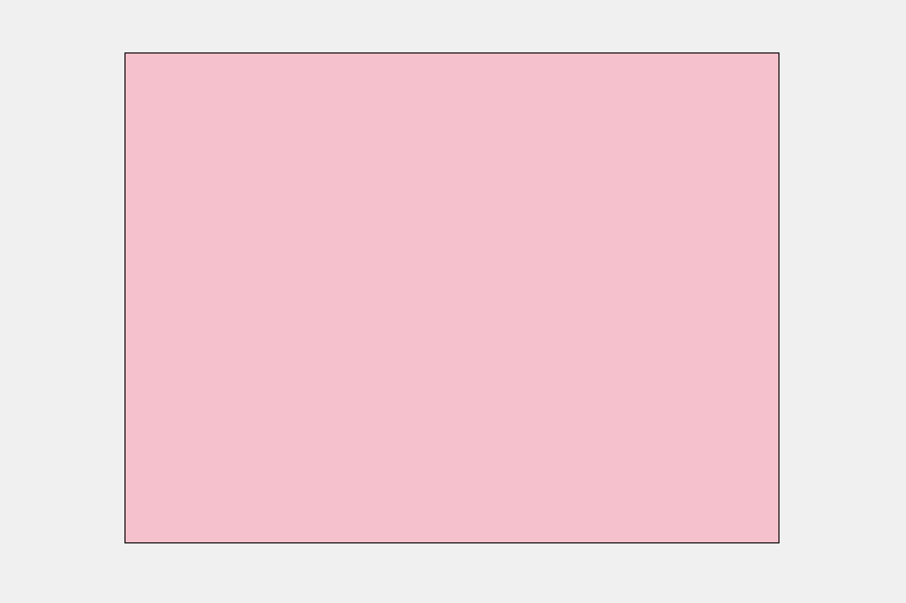

# TypeScript WebGPU Hello World

A simple "Hello World" example using TypeScript and WebGPU. This project demonstrates the basic setup for a WebGPU application, resulting in a canvas cleared to a HotPink color.

## Project Goal

The primary goal is to establish a minimal WebGPU application written in TypeScript that provides a clear visual indication of successful WebGPU initialization and operation (e.g., a colored canvas).

## Key Features

*   **TypeScript:** The project is written entirely in TypeScript.
*   **WebGPU:** Utilizes the WebGPU API for rendering.
*   **Minimal Setup:** Focuses on the bare essentials to get WebGPU running:
    *   WebGPU initialization and device acquisition.
    *   Canvas setup for presentation.
    *   Clearing the canvas to a single color (HotPink).
    *   Does **not** include complex shaders, buffers, or rendering pipelines for this initial version.
*   **Output:** A simple HTML page (`index.html`) that runs the compiled TypeScript code.

## Local Setup and Running Instructions

To set up and run this project locally:

1.  **Clone the repository:**
    ```bash
    git clone https://github.com/AsherJingkongChen/typescript-webgpu-helloworld.git
    cd typescript-webgpu-helloworld
    ```

2.  **Install dependencies:**
    ```bash
    npm install
    ```

3.  **Build the project (compile TypeScript):**
    ```bash
    npm run build
    ```
    This will compile the TypeScript files from `src/` into the `dist/` directory.

4.  **Serve the project using a local HTTP server:**
    Due to browser security restrictions (CORS policy) when using `file:///` protocol with JavaScript modules and WebGPU, you need to serve `index.html` via a local HTTP server.
    A simple way to do this is using `npx serve` (requires Node.js/npm):
    ```bash
    npx serve
    ```
    This will typically start a server at `http://localhost:3000`.

    Alternatively, you can use other methods like Python's built-in HTTP server:
    *   For Python 3: `python -m http.server` (usually serves at `http://localhost:8000`)
    *   For Python 2: `python -m SimpleHTTPServer`

5.  **Open in browser:**
    Open the URL provided by your local HTTP server (e.g., `http://localhost:3000`) in a WebGPU-compatible browser. You should see a canvas filled with a HotPink color.

## Screenshot


